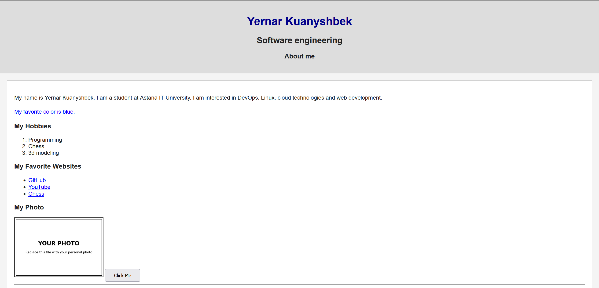
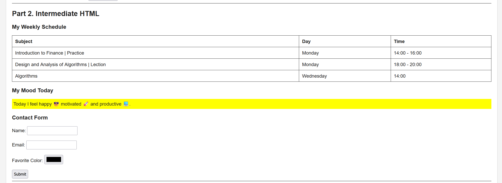
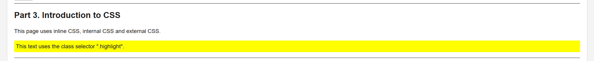
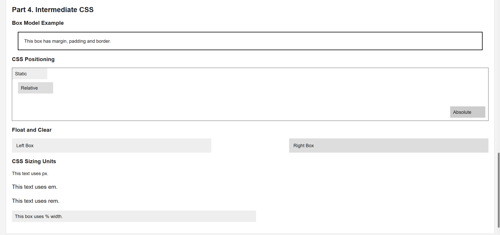

# Assignment #1 - HTML & CSS Basics

## Student Information

**Name:** Yernar Kuanyshbek
**Group:** SE-2539
---

## Objective

The objective of this assignment was to learn the basics of HTML and CSS and create a simple webpage.

---

## Part 1. Introduction to HTML

In this part I created:

- Basic HTML structure
- Headings from `h1` to `h3`
- Paragraphs
- Ordered and unordered lists
- An image
- Clickable links
- A button

### Screenshot

---

## Part 2. Intermediate HTML

In this part I created:

- A weekly schedule table
- A paragraph with emojis
- A form with Name, Email, Favorite Color and Submit button

### Screenshot

---

## Part 3. Introduction to CSS

In this part I used:

- Inline CSS
- Internal CSS
- External CSS
- Element selectors
- Class selectors
- ID selectors

### Screenshot

---

## Part 4. Intermediate CSS

In this part I used:

- Favicon
- Div elements
- Margin
- Padding
- Border
- Static positioning
- Relative positioning
- Absolute positioning
- px
- %
- em
- rem
- Float
- Clear

### Screenshot

---

## Summary

During this assignment, I learned how HTML is used to create the structure of a webpage and how CSS is used to style it.

I also practiced working with lists, links, images, tables, forms, selectors, the box model, positioning, sizing units, float and clear.

---

## Project Files

- `index.html` - main webpage
- `style.css` - external CSS file
- `favicon.png` - website favicon
- `my-photo.png` - personal photo placeholder
- `screenshots/` - screenshots for the assignment report

